Yes. I checked the **actual `Images` folder in your GitHub repository** and it contains the 28 image files you uploaded, including `1.png`, `2.png`, `3.png`, `5.1.png`, `5.2.png`, `15.1.png`, `19.1.png`, `19.2.png`, `20.1.png`, `20.2.png`, etc. ([GitHub][1])

Below is a **complete README from scratch**, using the **same `./Images/...` image paths**, and using **symbols instead of numbered sections**.

Copy everything inside the code block into your `README.md`.

````markdown
# 🏢 HR DATAFORGE — Multi-Workbook HR Data Cleaning & Workforce Analysis Using Power Query

> **An end-to-end HR data cleaning, transformation, consolidation, validation, and workforce analysis project using Microsoft Excel, Power Query, and PivotTables.**

---

## 📌 Project Overview

This project demonstrates an end-to-end **HR Data Cleaning and Workforce Analysis workflow** using **Microsoft Excel and Power Query**.

The project started with multiple monthly HR Excel workbooks containing employee-level records. Instead of manually opening, cleaning, and combining every workbook, **Power Query** was used to create a repeatable data transformation workflow.

The five monthly HR workbooks were consolidated into a single master dataset, followed by extensive data cleaning, standardization, validation, transformation, and calculated-field creation.

After the Power Query transformation process was completed, the cleaned dataset was loaded back into Excel and used to create multiple **section-wise PivotTable analyses**.

The final analysis covers:

🔹 Department & Job Role  
🔹 Manager  
🔹 Experience  
🔹 Shift  
🔹 Performance  
🔹 Location & State  
🔹 Month-wise workforce information  
🔹 Employee Count  
🔹 Salary  
🔹 Bonus  
🔹 Attendance  
🔹 Total Compensation  

The overall workflow can be summarized as:

**Raw HR Workbooks → Power Query → Data Cleaning → Data Transformation → Validation → Clean Master Dataset → Load to Excel → PivotTables → Workforce Analysis**

---

## 🎯 Project Objective

The main objective of this project was to:

🔹 Consolidate multiple monthly HR Excel workbooks into one master dataset.

🔹 Clean and standardize inconsistent employee data using Power Query.

🔹 Remove duplicate, unnecessary, temporary, and repeated records.

🔹 Handle missing, blank, null, and non-applicable values appropriately.

🔹 Standardize categorical fields such as Department, Job Role, Location, State, Manager, Shift, and Performance.

🔹 Convert fields into appropriate data types.

🔹 Validate employee email records and identify invalid values.

🔹 Create calculated fields such as **Total Compensation**.

🔹 Create a **Month-wise** field from monthly workbook names.

🔹 Load the final cleaned dataset into Excel.

🔹 Create multiple PivotTables for workforce analysis and reporting.

---

## 🛠️ Tools & Technologies Used

🔹 **Microsoft Excel**

🔹 **Power Query**

🔹 **Excel PivotTables**

🔹 **Power Query Column Quality**

🔹 **Power Query Data Transformation**

🔹 **Power Query Group By**

🔹 **Folder-Based Data Consolidation**

---

# 📂 Source Data

The project uses **5 monthly HR Excel workbooks** stored in a folder.

The monthly files follow a naming structure similar to:

```text
01_January_2026.xlsx
02_February_2026.xlsx
03_March_2026.xlsx
04_April_2026.xlsx
05_May_2026.xlsx
````

Each workbook contains employee-level HR information such as:

🔹 Employee ID
🔹 Employee Name
🔹 Department
🔹 Job Role
🔹 Joining Date
🔹 Salary
🔹 Bonus
🔹 Location
🔹 State
🔹 Manager
🔹 Shift
🔹 Performance
🔹 Experience
🔹 Attendance
🔹 Email

The five monthly workbooks were consolidated into a single employee-level dataset.

---

# 📸 Project Task & Initial Workflow

The project began by defining the HR data cleaning and workforce analysis requirements.

The initial workflow identified the major tasks required to transform the raw monthly workbooks into a clean and analysis-ready dataset.

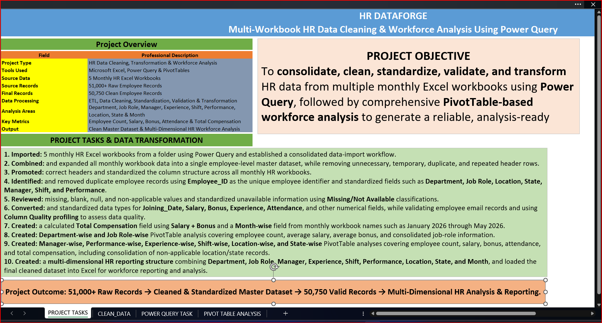

---

# 📊 Combining Multiple Excel Workbooks

The monthly HR workbooks were combined into a single dataset using Power Query.

Instead of manually copying and pasting records from every workbook, the folder-based Power Query approach automatically collected the files and consolidated their employee records.

This created a centralized master dataset while preserving the monthly source information.

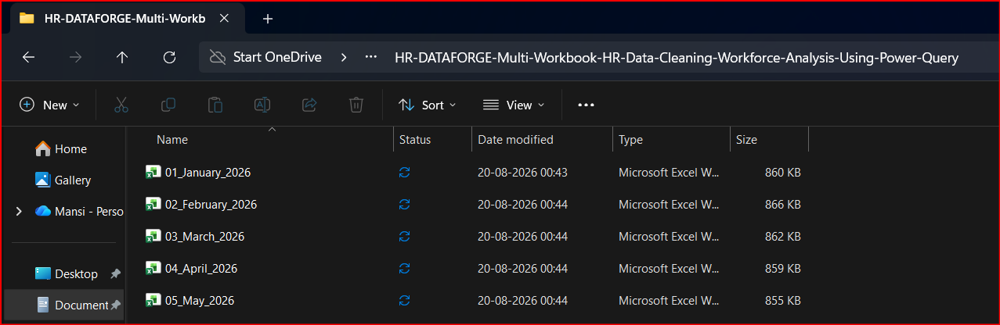

---

# ⚙️ Power Query Data Transformation

After importing the workbooks, the data was opened in **Power Query Editor**.

Power Query provided a structured environment for performing the complete ETL process:

🔹 Extract
🔹 Transform
🔹 Clean
🔹 Validate
🔹 Standardize
🔹 Load

The transformation steps were recorded under **Applied Steps**, making the cleaning process traceable and repeatable.

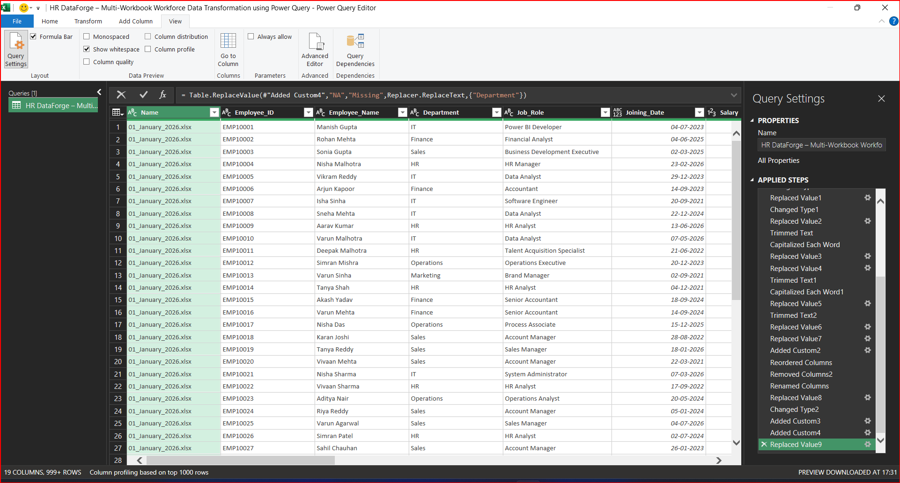

---

# 🧹 Performing Data Cleaning Tasks

Multiple cleaning operations were performed on the consolidated dataset.

The cleaning process included:

🔹 Removing unnecessary rows and columns

🔹 Removing repeated headers

🔹 Promoting the correct headers

🔹 Removing duplicate employee records

🔹 Trimming unnecessary spaces

🔹 Standardizing capitalization

🔹 Correcting inconsistent text values

🔹 Replacing incorrect or inconsistent values

🔹 Handling missing and null values

🔹 Standardizing data types

🔹 Validating employee information

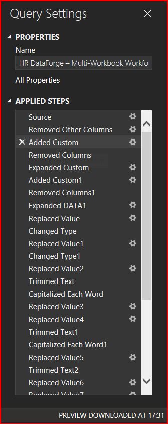

---

# 🔗 Queries & Connections

The **Queries & Connections** area was used to manage the Power Query workflow and the different analytical queries created from the master dataset.

The project contains multiple analysis queries such as:

🔹 Department Summary

🔹 Performance Summary

🔹 Shift Summary

🔹 Location Summary

🔹 Experience Summary

🔹 Manager Summary

This structure helped keep the transformation and reporting workflow organized.

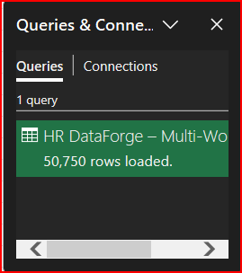

---

# 🧽 Cleaned Master Data

After applying the cleaning and transformation steps, the employee records were standardized into a cleaner and more consistent structure.

The cleaned dataset was then used as the foundation for the subsequent workforce analysis.

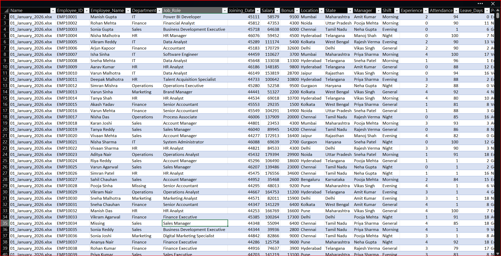

---

# 🔄 Additional Power Query Transformations

Additional Power Query transformations were performed to prepare the dataset for reporting.

These transformations included:

🔹 Replacing inconsistent values

🔹 Standardizing text

🔹 Changing data types

🔹 Creating calculated fields

🔹 Reordering columns

🔹 Removing unnecessary fields

🔹 Sorting records

🔹 Grouping records for analysis

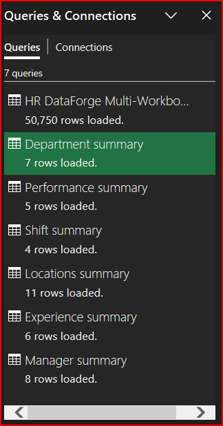

---

# 📈 Section-Wise Workforce Analysis

After completing the cleaning process, the project moved from **data preparation to workforce analysis**.

The cleaned dataset was used to create separate analytical sections.

The major workforce analysis areas were:

🔹 Department & Job Role

🔹 Manager

🔹 Experience

🔹 Shift

🔹 Performance

🔹 Location & State

Each section uses relevant HR metrics according to the business question being analyzed.

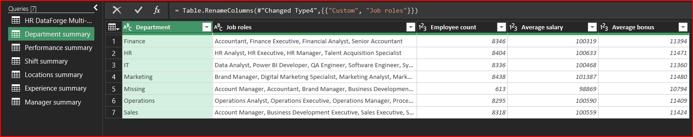

---

# 🧮 Grouping & Summary Calculations

Power Query's **Group By** functionality was used to create summary-level information.

Depending on the analysis, employee records were grouped and summarized using metrics such as:

🔹 Employee Count

🔹 Average Salary

🔹 Average Bonus

🔹 Total Compensation

🔹 Attendance

This helped transform detailed employee-level records into useful analytical summaries.

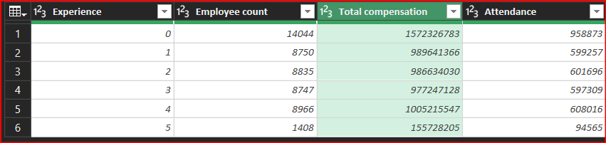

---

# 💰 Total Compensation Calculation

A calculated **Total Compensation** field was created using:

```text
Total Compensation = Salary + Bonus
```

This field provides a more complete view of employee compensation than looking at salary alone.

The Total Compensation field was subsequently used in multiple PivotTable analyses.

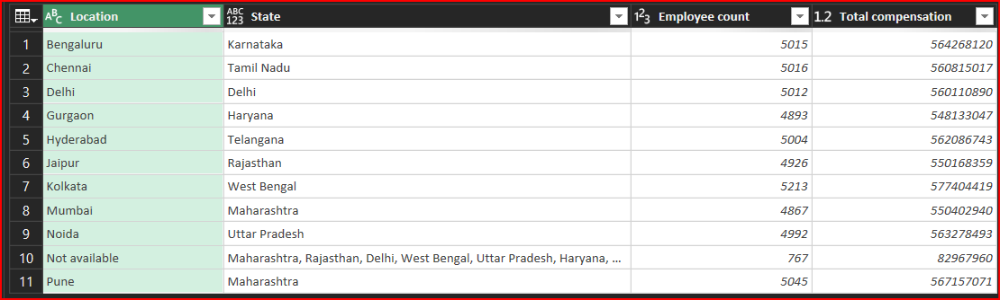

---

# 📅 Month-Wise Data Preparation

A **Month-wise** field was created from the monthly workbook names.

For example:

```text
01_January_2026.xlsx → January 2026
02_February_2026.xlsx → February 2026
03_March_2026.xlsx → March 2026
04_April_2026.xlsx → April 2026
05_May_2026.xlsx → May 2026
```

This makes it possible to compare workforce information across the five monthly HR workbooks.

The Month field can be used for future time-based workforce analysis.

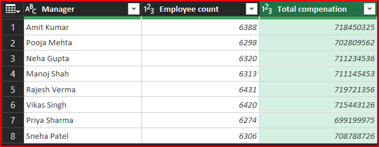

---

# 🔍 Data Quality & Validation

Power Query's **Column Quality** functionality was used to review the quality of the transformed dataset.

The data was checked for:

🔹 Valid values

🔹 Error values

🔹 Empty values

🔹 Missing values

🔹 Null values

This helped verify that the final master dataset was suitable for analysis.

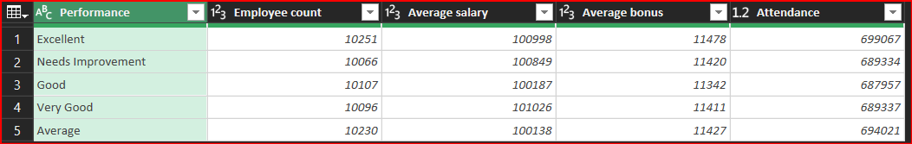

---

# 📋 Cleaned Data Structure

After completing the transformation process, the final employee-level dataset was prepared with standardized fields and consistent formatting.

The dataset was now ready to be loaded into Excel for reporting and PivotTable analysis.

---

# 📥 Loading the Cleaned Data into Excel

Once all Power Query transformations were completed, the final cleaned dataset was **loaded back into Microsoft Excel**.

This created a structured and analysis-ready Excel dataset that could be used as the source for PivotTables.

The cleaned dataset contains approximately **50,750 employee records** after the consolidation and cleaning process.

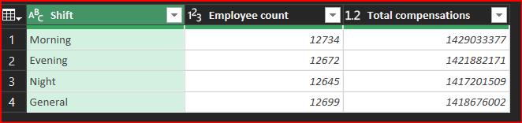

---

# 📊 Final Clean Dataset in Excel

The transformed Power Query output was loaded into Excel and verified before beginning the workforce analysis.

This step ensured that:

🔹 The records were successfully loaded

🔹 Columns were correctly structured

🔹 Calculated fields were available

🔹 Data types were appropriate

🔹 The master dataset was ready for PivotTable reporting

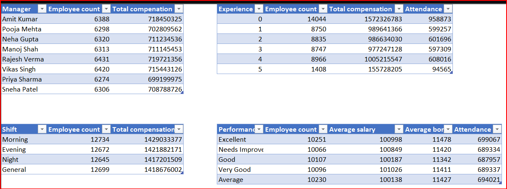

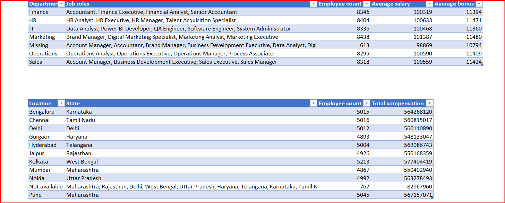

---

# 📊 Workforce PivotTable Analysis

After loading the cleaned master dataset into Excel, multiple PivotTables were created.

The PivotTables were designed to summarize the employee data from different HR perspectives.

The main reporting sections were:

🔹 Department & Job Role

🔹 Manager

🔹 Experience

🔹 Shift

🔹 Performance

🔹 Location & State

---

# 🏢 Department & Job Role PivotTable

A combined **Department & Job Role PivotTable** was created.

This PivotTable shows:

🔹 Department

🔹 Job Roles within each department

🔹 Employee Count

🔹 Average Salary

🔹 Average Bonus

The Job Role information was consolidated within each Department so that the organizational structure could be viewed in a single report.

This analysis helps answer questions such as:

🔹 How many employees work in each department?

🔹 What job roles exist within each department?

🔹 Which department has the largest workforce?

🔹 What is the average salary by department?

🔹 What is the average bonus by department?

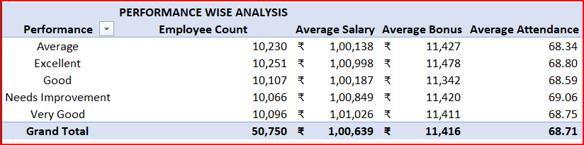

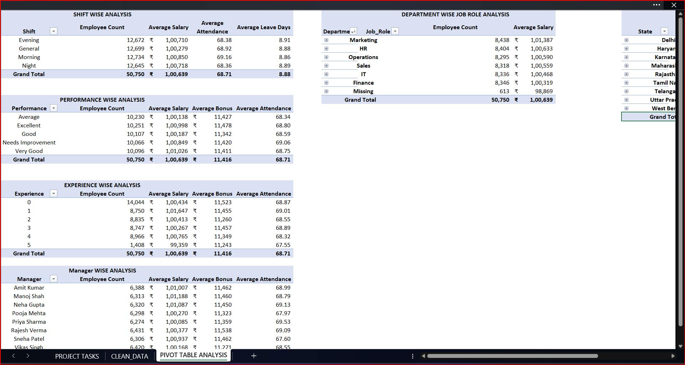

---

# 👨‍💼 Manager-Wise PivotTable

A **Manager-wise PivotTable** was created to understand workforce distribution and compensation by manager.

The report includes:

🔹 Manager

🔹 Employee Count

🔹 Total Compensation

This analysis provides a clear view of team size and the total compensation associated with each manager.

It can help identify managers with larger teams and higher overall compensation responsibility.

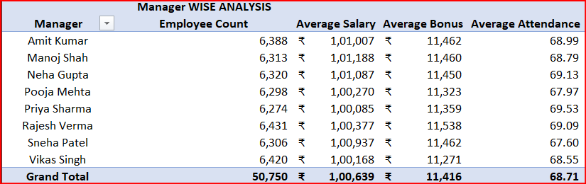

---

# 📈 Experience-Wise PivotTable

An **Experience-wise PivotTable** was created to understand workforce distribution across different experience levels.

The report includes:

🔹 Experience

🔹 Employee Count

🔹 Total Compensation

🔹 Attendance

This analysis helps compare workforce size, compensation, and attendance across different employee experience levels.

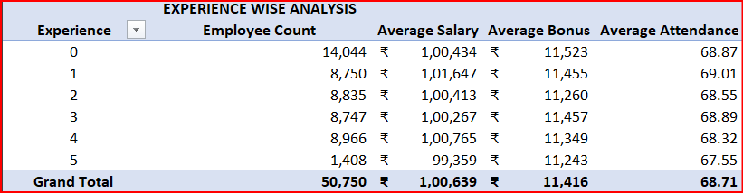

---

# 🌅 Shift-Wise PivotTable

A **Shift-wise PivotTable** was created to analyze employees according to their working shifts.

The report includes:

🔹 Morning

🔹 Evening

🔹 Night

🔹 General

The main metrics are:

🔹 Employee Count

🔹 Total Compensation

This provides a clear understanding of workforce distribution across different working shifts.

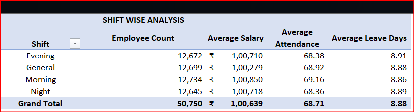

---

# ⭐ Performance-Wise PivotTable

A **Performance-wise PivotTable** was created to analyze employees according to their performance category.

The performance categories include:

🔹 Excellent

🔹 Very Good

🔹 Good

🔹 Average

🔹 Needs Improvement

The report contains:

🔹 Employee Count

🔹 Average Salary

🔹 Average Bonus

🔹 Attendance

This analysis helps compare compensation and attendance patterns across different performance levels.

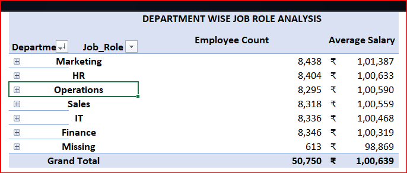

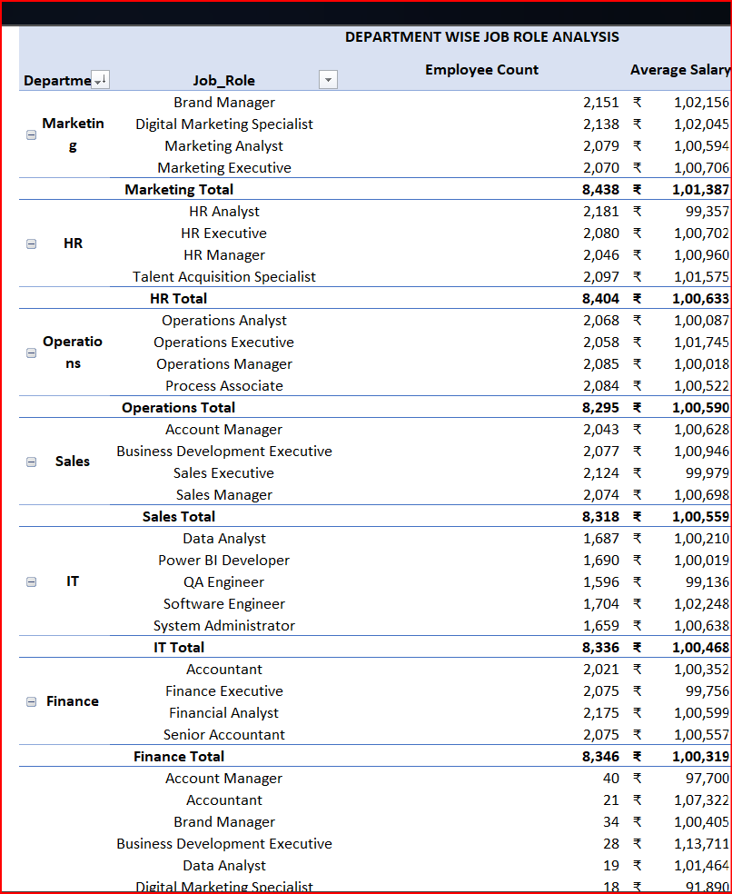

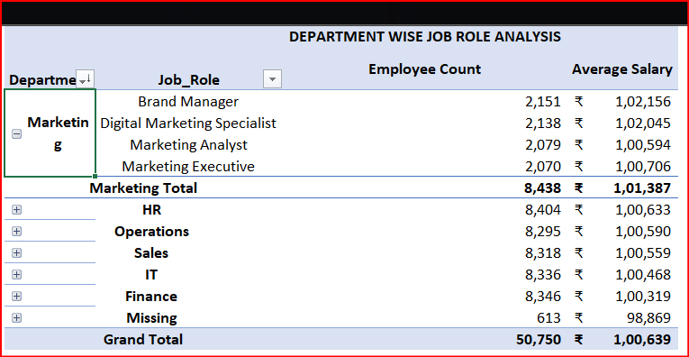

---

# 📍 Location & State PivotTable

A combined **Location & State PivotTable** was created to analyze the geographical distribution of employees.

The report contains:

🔹 Location

🔹 State

🔹 Employee Count

🔹 Total Compensation

The Location and State fields were kept together in the same analytical report so that each location could be viewed with its corresponding state.

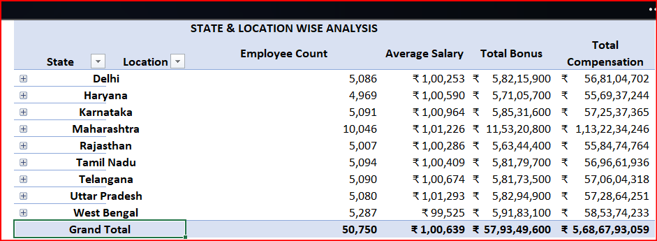

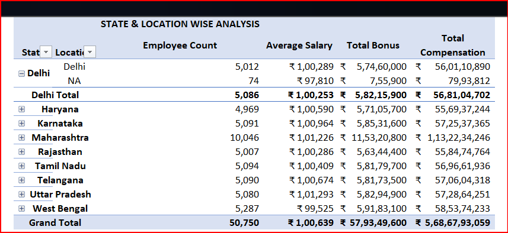

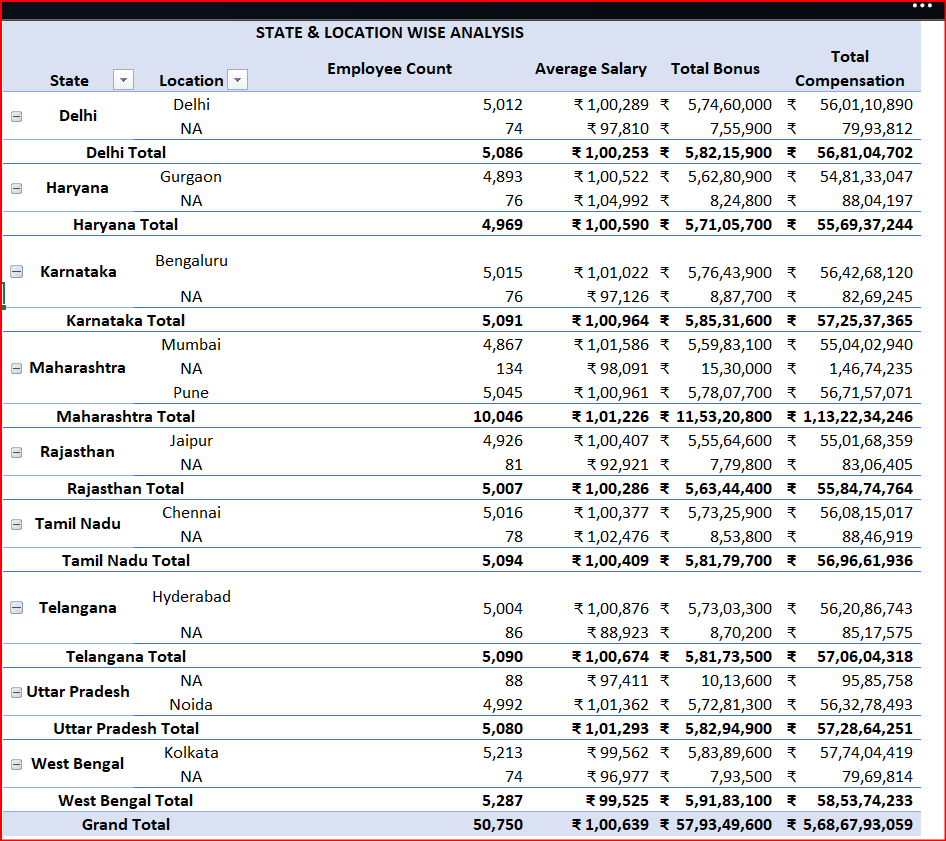

---

# 🚫 Handling Non-Applicable Location Data

Some employee records did not contain an applicable location.

Instead of deleting these employee records, the unavailable location information was retained and standardized as a **Not Available / Non-Applicable** category.

Where the State information was available, it was retained so that the employee records were not lost from the analysis.

This approach ensured that missing geographical information did not result in unnecessary removal of valid employee records.

The resulting PivotTable therefore includes a consolidated non-applicable location category along with the associated state information.

---

# 📊 Consolidated Workforce Reporting

The PivotTables created from the cleaned master dataset provide multiple views of the HR workforce.

The reporting structure covers:

| 📌 Section               | 📊 Main Metrics                                           |
| ------------------------ | --------------------------------------------------------- |
| 🏢 Department & Job Role | Employee Count, Average Salary, Average Bonus             |
| 👨‍💼 Manager            | Employee Count, Total Compensation                        |
| 📈 Experience            | Employee Count, Total Compensation, Attendance            |
| 🕐 Shift                 | Employee Count, Total Compensation                        |
| ⭐ Performance            | Employee Count, Average Salary, Average Bonus, Attendance |
| 📍 Location & State      | Employee Count, Total Compensation                        |

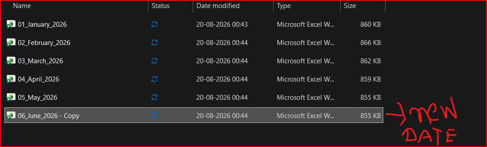

---

# 🔄 Adding a New Monthly Workbook

One of the important advantages of the folder-based Power Query approach is that new monthly HR workbooks can be added to the source folder.

For example, after the original five monthly workbooks, a new monthly workbook can be placed in the same folder.

The Power Query workflow can then detect the additional file during refresh.

This reduces the need to manually rebuild the entire dataset whenever a new monthly workbook becomes available.

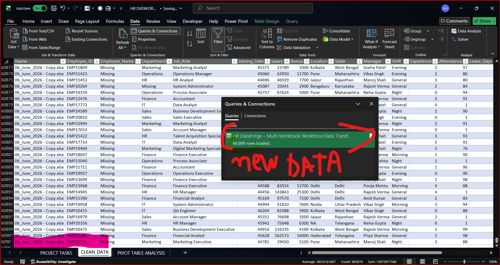

---

# 🔁 Refreshing the Power Query Workflow

After adding a new workbook to the source folder, the Power Query workflow can be refreshed.

The refresh process applies the previously created transformation steps to the new data.

This means that the same cleaning logic can be reused for the newly added monthly data.

The workflow therefore becomes more scalable and repeatable compared with manual Excel data preparation.

---

# 🧹 New Data After Refresh

After the new workbook is added and the Power Query process is refreshed, the new employee records are incorporated into the cleaned master dataset.

The existing transformation steps continue to be applied, including:

🔹 Header standardization

🔹 Text cleaning

🔹 Duplicate handling

🔹 Missing-value handling

🔹 Data-type conversion

🔹 Compensation calculation

🔹 Month-wise classification

🔹 Data validation

🔹 Standardized categorical values

This ensures that newly added data follows the same transformation rules as the original data.

---

# 📈 Updated Workforce Analysis

Once the master dataset is refreshed, the analytical outputs can also be updated.

This allows the same reporting structure to continue working when new monthly HR data is introduced.

The project therefore demonstrates not only one-time data cleaning, but also a **repeatable monthly HR data preparation and reporting workflow**.

---

# 🧩 Complete Project Workflow

The complete workflow implemented in this project can be represented as:

```text
📂 Monthly HR Excel Workbooks
            ↓
📥 Import from Folder
            ↓
🔗 Combine & Expand Workbooks
            ↓
🧹 Remove Unnecessary / Repeated Rows
            ↓
📋 Promote & Standardize Headers
            ↓
🔍 Identify & Remove Duplicates
            ↓
🧽 Clean Text & Categorical Fields
            ↓
🚫 Handle Missing / Null / Non-Applicable Values
            ↓
🔢 Standardize Data Types
            ↓
📧 Validate Employee Email Data
            ↓
📊 Column Quality Validation
            ↓
💰 Create Total Compensation
            ↓
📅 Create Month-Wise Field
            ↓
📥 Load Clean Dataset into Excel
            ↓
📊 Create PivotTables
            ↓
🏢 Department & Job Role
👨‍💼 Manager
📈 Experience
🕐 Shift
⭐ Performance
📍 Location & State
            ↓
📑 Final Workforce Reporting
            ↓
🔄 Add New Monthly Workbook & Refresh
```

---

# 📌 Key Data Transformation Activities

The project covered the following major data preparation activities:

🔹 **Imported** 5 monthly HR Excel workbooks from a folder.

🔹 **Combined** and expanded the monthly workbooks into one employee-level dataset.

🔹 **Removed** unnecessary, temporary, duplicate, and repeated header rows.

🔹 **Promoted** the correct headers and standardized the column structure.

🔹 **Identified** and removed duplicate employee records using Employee_ID.

🔹 **Cleaned** Department, Job Role, Location, State, Manager, Shift, and Performance fields.

🔹 **Reviewed** missing, blank, null, and non-applicable values.

🔹 **Converted** Joining Date, Salary, Bonus, Experience, Attendance, and other fields into appropriate data types.

🔹 **Validated** employee email records and reviewed data quality.

🔹 **Created** Total Compensation using Salary + Bonus.

🔹 **Created** Month-wise information from monthly workbook names.

🔹 **Loaded** the cleaned dataset into Excel.

🔹 **Created** multiple PivotTables for workforce reporting.

🔹 **Analyzed** workforce information by Department, Job Role, Manager, Experience, Shift, Performance, Location, and State.

🔹 **Refreshed** the workflow after adding new monthly data.

---

# 📊 Project Outcome

> **51,000+ Raw HR Records → 50,750 Clean Employee Records → Validated Master Dataset → Excel-Based Multi-Dimensional Workforce Analysis**

The project successfully transformed multiple monthly HR workbooks into a **clean, standardized, validated, analysis-ready master dataset** and converted the data into structured workforce reports using Excel PivotTables.

---

# 💡 Key Skills Demonstrated

🔹 Microsoft Excel

🔹 Power Query

🔹 ETL Data Preparation

🔹 Folder-Based Data Consolidation

🔹 Data Cleaning

🔹 Data Transformation

🔹 Duplicate Removal

🔹 Missing-Value Handling

🔹 Data Validation

🔹 Data Type Standardization

🔹 Text Standardization

🔹 Calculated Columns

🔹 Power Query Group By

🔹 Column Quality Analysis

🔹 PivotTable Analysis

🔹 HR Workforce Analytics

🔹 Multi-Dimensional Reporting

🔹 Refreshable Data Workflow

---

# 🏁 Final Conclusion

This project demonstrates how **Power Query can automate and standardize a complete HR data preparation workflow** when information is received through multiple monthly Excel workbooks.

Instead of manually cleaning and combining thousands of records every month, the transformation logic was created once in Power Query and reused through the refresh process.

The final cleaned dataset was then loaded into Excel and transformed into multiple workforce reports covering **Department & Job Role, Manager, Experience, Shift, Performance, and Location & State**.

The project therefore combines:

**📥 Data Import + 🧹 Data Cleaning + 🔄 Data Transformation + 🔍 Validation + 📊 Analysis + 📑 Reporting + 🔁 Refreshability**

to create a structured and reusable **HR workforce analytics solution using Excel and Power Query**.

```


[1]: https://github.com/Mansi232323/HR-DATAFORGE-Multi-Workbook-HR-Data-Cleaning-Workforce-Analysis-Using-Power-Query/tree/main/Images "HR-DATAFORGE-Multi-Workbook-HR-Data-Cleaning-Workforce-Analysis-Using-Power-Query/Images at main · Mansi232323/HR-DATAFORGE-Multi-Workbook-HR-Data-Cleaning-Workforce-Analysis-Using-Power-Query · GitHub"
